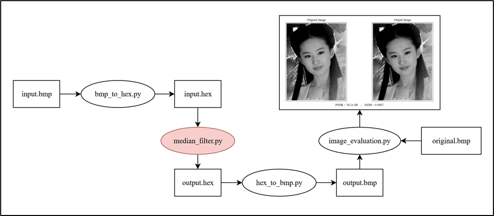

# Verilog Median Filter

This repository contains the implementation and simulation of a **3×3 median filter** for grayscale images. The project includes both **Python simulation** and **Verilog implementation**, along with example input and output images.

---

## Project Overview

The median filter is a **non-linear filter** that works as follows:

- For each pixel, a sliding window of size **N × N** (here N = 3) is applied.
- The pixel values in the window are **sorted in ascending order**.
- The **central pixel** is replaced with the **median value** of the window.

To verify and optimize the algorithm before hardware implementation, a **Python simulation** was performed with the following steps:

1. **Convert BMP to pixel data:** The input grayscale image (`input.bmp`) is read in Python and converted to an array of pixel values. Each pixel is represented in **hexadecimal** and saved to `input.hex`, which serves as the input for both Python and Verilog simulations.  
2. **Median filtering:** A **3×3 sliding window** is applied to all pixels. The filtered output is saved to `output.hex`.  
3. **Convert back to BMP:** The hexadecimal output file is converted back to grayscale BMP (`output.bmp`) for evaluation.  
4. **Quality evaluation:** The filtered image is compared to the original (`original.bmp`) using **PSNR** and **SSIM** metrics.

---

## Folder Structure
```
├── python/                         # Python simulation and evaluation scripts
│   ├── 1_bmp_to_hex.py             # Convert grayscale BMP image to hex format
│   ├── 2_median_filter.py          # Python implementation of 3×3 median filter
│   ├── 3_hex_to_bmp.py             # Convert filtered hex data back to BMP image
│   └── 4_image_evaluation.py       # Image quality evaluation (PSNR, SSIM)
│
├── rtl/                            # Verilog HDL implementation
│   ├── find_min_max.v              # Module to find min and max values
│   ├── find_min_mid_max.v          # Helper module for median calculation
│   ├── median_3x3.v                # Core 3×3 median filter module
│   ├── tb_median_filter.v          # Testbench (single kernel version)
│   └── tb_median_filter_pro.v      # Testbench (dual-kernel parallel version)
│
├── images/                         # Example input/output images and data
│   ├── input.bmp                   # Noisy input image (salt-and-pepper noise)
│   ├── input.hex                   # Hexadecimal pixel data of noisy image
│   ├── output.bmp                  # Filtered image generated by Python
│   ├── output.hex                  # Hex data of Python filtered result
│   ├── verilog.hex                 # Hex data of Verilog filtered result
│   └── original.bmp                # Original clean image for reference
│
└── README.md                    
```

---

## Example Images

**Figure 1:** Example of input noisy image and filtered output.  


**Figure 2:** Workflow of the median filter simulation in Python.  



---
